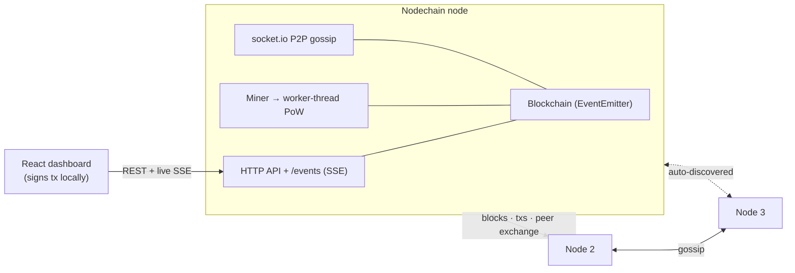

# Nodechain Lab


> A hands-on, **real-time** blockchain built from scratch in Node.js - peer-to-peer
> gossip, self-mining nodes, off-thread proof-of-work, a live React dashboard, and
> a one-command multi-node demo. Educational, not a production cryptocurrency.

<!-- Badge path assumes github.com/yabtesfu/nodechain-lab - update it if your repo differs. -->

Nodechain Lab starts from the classic "toy blockchain" idea and adds the moving
parts that make it feel like a real network:

- ⛏️ **Proof-of-work** mining with adjustable, retargeting difficulty
- ✍️ **Signed transactions** (secp256k1), an account model with balances, nonces,
  fees, and miner rewards
- 🗳️ **Fee-prioritized mempool** and Merkle-root block integrity
- 📡 **Real-time P2P** over WebSockets: new blocks and transactions gossip across
  the network instantly, with flood-relay and **automatic peer discovery**
- 🤝 **Cumulative-work consensus**: the heaviest valid chain wins; forks resync
- 🥁 **Self-driving miner**: nodes mine on their own; the grind runs in a **worker
  thread** so the node stays responsive, and a stale grind is cancelled when a
  better block arrives
- 📊 **Live React dashboard**: watch blocks land, the mempool fill/drain, peers,
  and balances update in real time (Server-Sent Events)
- 🔒 **Client-side signing**: the dashboard signs transactions in the browser -
  **private keys never leave your device**
- 📦 **One-command multi-node demo** via Docker Compose

## Architecture



Each node is both a socket.io **server** (accepts peers) and **client** (dials
peers) on one shared HTTP port. The blockchain emits events that drive the miner,
the gossip layer, and the dashboard's live stream.

## Quick start (single node)

```bash
npm install
npm test
npm start            # HTTP API + P2P on http://localhost:3000
```

Build and serve the dashboard from the node:

```bash
cd web && npm install && npm run build && cd ..
npm start            # now http://localhost:3000 also serves the live dashboard
```

For dashboard development with hot reload:

```bash
cd web && npm run dev   # Vite dev server on http://localhost:5173 (talks to :3000)
```

## Multi-node demo (Docker)

```bash
docker compose up --build
```

This starts three nodes that **discover each other and reach consensus live**:

| Node  | Dashboard              | Role                         |
| ----- | ---------------------- | ---------------------------- |
| node1 | http://localhost:3001  | auto-mines                   |
| node2 | http://localhost:3002  | dials node1                  |
| node3 | http://localhost:3003  | dials node2 (finds node1)    |

Open all three dashboards side by side and watch every block node1 mines ripple
across the network.

## API quick tour

```bash
# Create a wallet (CLI convenience; the dashboard generates keys in the browser)
curl -X POST http://localhost:3000/wallets

# Inspect state
curl http://localhost:3000/overview        # one-shot snapshot for the UI
curl http://localhost:3000/chain
curl http://localhost:3000/peers
curl http://localhost:3000/accounts/<address>   # balance + next nonce

# Mine one block
curl -X POST http://localhost:3000/mine \
  -H "Content-Type: application/json" -d '{"minerAddress":"<address>"}'

# Auto-mining
curl -X POST http://localhost:3000/mining/start \
  -H "Content-Type: application/json" -d '{"minerAddress":"<address>","interval":4000,"mineEmpty":true}'
curl -X POST http://localhost:3000/mining/stop

# Live event stream (what the dashboard listens to)
curl http://localhost:3000/events
```

Transactions are submitted **pre-signed only** - the dashboard (or any wallet)
signs them locally and posts the signature and public key; the node never
receives a private key.

## Configuration (environment variables)

| Variable         | Purpose                                                      |
| ---------------- | ----------------------------------------------------------- |
| `PORT`           | HTTP + P2P port (default 3000)                              |
| `PEERS`          | Comma-separated peer URLs to dial on boot                   |
| `ADVERTISED_URL` | The address this node advertises to peers (multi-host)      |
| `MINER_ADDRESS`  | Auto-start mining rewards to this address                   |
| `MINE_INTERVAL`  | Auto-mining tick in ms                                      |
| `MINE_EMPTY`     | `true` to also mine empty blocks on the heartbeat           |
| `GRIND_TIMEOUT`  | Max ms for a single PoW grind before it is abandoned        |
| `NODECHAIN_DATA` | JSON snapshot path for persistence                          |

## Project layout

```
src/
  block.js         block shape, hashing, mining, Merkle root
  blockchain.js    chain state, validation, difficulty, consensus, events
  transaction.js   transaction model, signing payload, verification
  wallet.js        local key generation and signing helpers
  crypto.js        canonical hashing + secp256k1 (hex keys, shared with the browser)
  mempool.js       fee-ordered pending transactions
  miner.js         self-driving miner (worker-thread PoW, stale-grind cancel)
  pow.js           worker orchestration (cancellable grind)
  pow-worker.js    the proof-of-work grind (runs off the main thread)
  p2p.js           socket.io gossip, flood relay, peer discovery
  sse.js           Server-Sent Events hub for the dashboard
  server.js        Express API + P2P + miner + SSE wiring
web/               Vite + React dashboard (client-side signing)
tests/             node:test coverage for core behavior
Dockerfile, docker-compose.yml   multi-node demo
```

## Testing

```bash
npm test            # node's built-in test runner
```

Coverage spans crypto, mempool, P2P gossip/discovery, the auto-miner (including
worker-thread cancellation), and the SSE hub.

## Notes

- **Educational, not production.** No real economic security; difficulty and
  rewards are toy values.
- **No chain-id / domain separation yet.** Signatures are not bound to a specific
  network, so a transaction signed for one deployment could in principle be
  replayed on another identically-configured deployment where the same address is
  funded at the same nonce. A configurable network id in the signed payload is a
  natural next step.
- The dashboard's dev dependency `vite` carries dev-server-only advisories that do
  not affect the built static assets served in production; a patched `esbuild` is
  pinned via an override.

## License

MIT - see [LICENSE](LICENSE).
